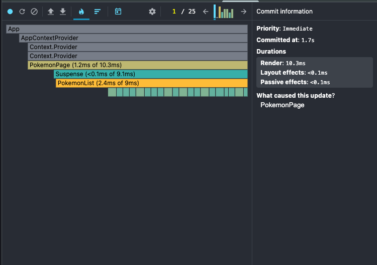
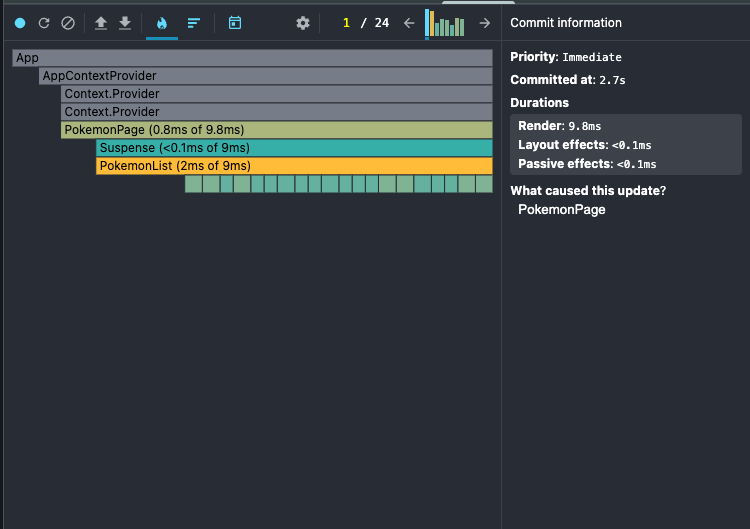

## Skill-Refresh Program

Daily learning + assessment program to sharpen skills

## what I've learned in this build-1
- revisited Context API
- memoization
- performance profiling
- closer look to details

### Profiler results

Before I wrap each list item with `memo` function. Overall render time of the list 2.4ms

After wrapping, render time 2ms:

In both scenarios click handler on each row has been wrapped with `useCallback`

